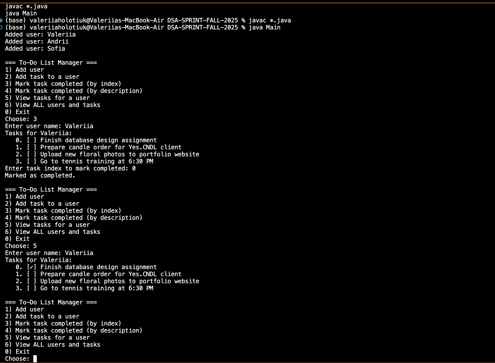

To-Do List Manager 

Valeriia Holotiuk
Keyin College — DSA Sprint Fall 2025

Overview
This project demonstrates the use of arrays and singly linked lists in Java by implementing a simple To-Do List Manager. Each user has their own personal to-do list where they can add, mark, and view tasks. The program allows multiple users to manage their own to-do lists. Each user is stored in an array, and their tasks are stored in a singly linked list.

Key Concepts 
• Object-Oriented Programming (OOP)
• Arrays for storing users
• Singly Linked Lists for storing tasks
• Encapsulation and modular class design

Features
1. User Management
• Create users and store them in an array.
• Each user has a unique name (duplicate names are ignored).
2. Task Management
• Add new tasks to a user's to-do list.
• Each task includes a description and completion status.
• Tasks are stored as nodes in a singly linked list.
3. Mark Tasks as Completed
• Ability to mark a task as completed (by name or index).
4. View Tasks
• View all tasks in a user's to-do list, along with their completion status.

Class Overview:

Class	       Description
Task	       Represents a single to-do item (description + completion status).
TaskNode	   Node class for the singly linked list.
TaskList	   Manages the linked list of tasks for each user.
User	       Represents a user and their personal TaskList.
Main	       Handles user creation, adding tasks, marking completion, and printing lists.

How to Run
1. Open the project folder in your terminal or IDE.
2. Compile all Java files: javac *.java
3. Run the program: java Main
4. The output will display all users and their task lists with completion status.

Example Output
=== To-Do Lists ===
Tasks for Valeriia:
   0. [✓] Finish database design assignment
   1. [ ] Prepare candle order for client
   2. [ ] Upload new floral photos to portfolio website
   3. [✓] Go to tennis training at 6:30 PM

Tasks for Andrii:
   0. [ ] Fix login bug in React app
   1. [ ] Write documentation for API endpoints
   2. [ ] Evening shift at Jag hotel

Tasks for Sofia:
   0. [ ] Schedule meeting with design team
   1. [✓] Buy flowers for weekend event
   2. [ ] Review UI/UX project submissions

